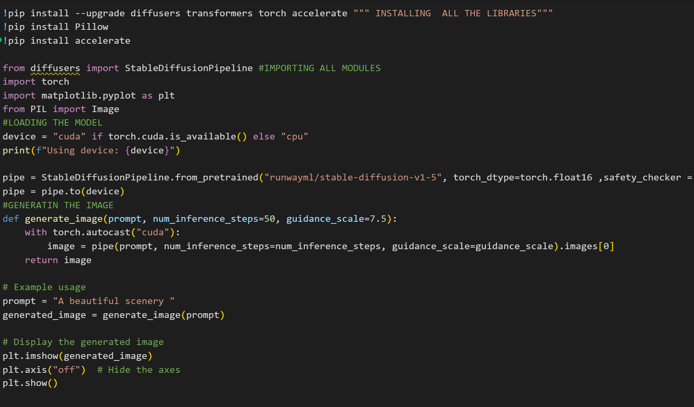

# Stable-Diffusion-Image-Generator
"A project to generate high-quality images using Stable Diffusion models. This project includes code for setting up and running image generation, customizing the generated content, and ensuring appropriate content."  Feel free to modify it to better suit your project specifics.

 

## Description

This project utilizes Stable Diffusion models to generate high-quality images. The Stable Diffusion technique gradually refines images by iteratively adding noise to the input, resulting in visually appealing outputs. This repository provides code for setting up, running, and customizing the image generation process.


.png)   .png)
## Features

- **Image Generation**: Utilize Stable Diffusion models to generate diverse and high-quality images.
- **Customization**: Adjust parameters to control the style and content of generated images..
- **Documentation**: Comprehensive documentation and examples to help users get started and customize the project.

## Requirements

- Python 3.11
- PyTorch
- Stable Diffuser
- Pillow

## Languages Used:

 - Python

## Installation
## For VS code 
1. Copy the packages to install :
   ```bash
   pip install --upgrade diffusers transformers torch accelerate 
   pip install Pillow
   
2. Copy the code and paste in vs code:
   ```bash
   from diffusers import StableDiffusionPipeline
   import torch
   import matplotlib.pyplot as plt
   from PIL import Image
   #LOADING THE MODEL
   device = "cuda" if torch.cuda.is_available() else "cpu"
   print(f"Using device: {device}")

   pipe = StableDiffusionPipeline.from_pretrained("runwayml/stable-diffusion-v1-5", torch_dtype=torch.float16 ,safety_checker = None, requires_safety_checker = False)
   pipe = pipe.to(device)
   #GENERATIN THE IMAGE
   def generate_image(prompt, num_inference_steps=50, guidance_scale=7.5):
       with torch.autocast("cuda"):
           image = pipe(prompt, num_inference_steps=num_inference_steps, guidance_scale=guidance_scale).images[0]
    return image

   # Example usage
   prompt = "a porche"
   generated_image = generate_image(prompt)

   # Display the generated image
   plt.imshow(generated_image)
   plt.axis("off")  # Hide the axes
   plt.show()


2. Run the code and generate your images 😊😁


## Other way of using the code using "Google Collab" :

1. Go to "Google Collab" and create a notebook.
2. Change the runtime to "T4 GPU"
3. Copy the code from "image_ai.py" and paste the code in code box.
4. Enter the prompt into the prompt section given in the code to generate the image.

## Creator
Created and developed by Abhinav Shakya
